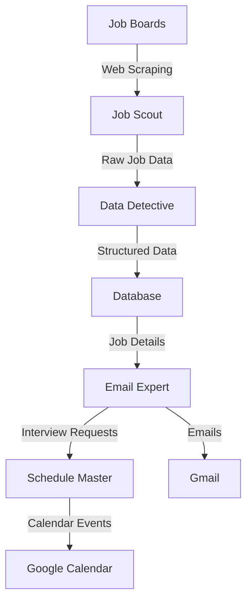
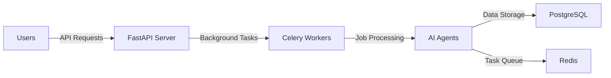

# 🤖 Building a Smart Job Search Assistant: A Journey into Multi-Agent AI Systems

Hey there! 👋 Welcome to the behind-the-scenes look at our Job Search Assistant. Whether you're a developer, AI enthusiast, or just curious about how AI can help with job hunting, this guide will walk you through our system in a friendly, easy-to-understand way.

## 🎯 What We're Building

Imagine having a team of AI assistants working 24/7 to help you find your dream job:
- One assistant constantly scanning job boards for perfect matches
- Another analyzing job descriptions and extracting key information
- A third handling all your email communications
- And a fourth managing your interview schedule

That's exactly what we've built! Let's dive into how it all works.

## 🧠 The Brain of the System: Multi-Agent Architecture

### What's a Multi-Agent System? 
Think of it like a team of specialists working together. Just like you might have different doctors in a hospital (each with their specialty), we have different AI agents, each expert in their specific task.

Here's our dream team:

#### 1. 🕵️‍♂️ Job Scout (Data Collection Agent)
- **Mission**: Find the perfect job matches
- **Tools**: 
  - [Selenium](https://www.selenium.dev/) for web navigation
  - [BeautifulSoup4](https://www.crummy.com/software/BeautifulSoup/) for parsing web pages
  - [OmniParser](https://huggingface.co/microsoft/OmniParser) for structured data extraction
- **Special Power**: Can search multiple job boards simultaneously

#### 2. 🔍 Data Detective (Information Extraction Agent)
- **Mission**: Extract and organize job information
- **Tools**: 
  - [OpenAI's GPT-4](https://openai.com/gpt-4) for understanding job descriptions
  - Custom pattern matching for key information
- **Special Power**: Understands complex job requirements and company culture hints

#### 3. 📧 Email Expert (Communication Agent)
- **Mission**: Handle all email communications
- **Tools**: 
  - [Gmail API](https://developers.google.com/gmail/api) for email management
  - GPT-4 for email composition
- **Special Power**: Writes personalized, professional emails

#### 4. 📅 Schedule Master (Scheduler Agent)
- **Mission**: Manage interview scheduling
- **Tools**: 
  - [Google Calendar API](https://developers.google.com/calendar) for scheduling
  - Time zone handling
- **Special Power**: Finds perfect interview slots that work for everyone

## 🏗️ System Architecture: How It All Fits Together

### 🛠️ The Tech Stack We're Using

1. **Core Framework**: [Phidata](https://docs.phidata.com/)
   - Why? It's perfect for building AI agents and makes them work together smoothly
   - Handles the complex stuff so we can focus on making our agents smarter

2. **Brain Power**: [OpenAI's GPT-4](https://openai.com/gpt-4)
   - Powers our agents' understanding and decision-making
   - Helps write natural-sounding emails and analyze job descriptions

3. **Data Storage**: [PostgreSQL](https://www.postgresql.org/)
   - Keeps track of all jobs, applications, and communications
   - Think of it as our system's memory

4. **Job Search Tools**:
   - [LinkedIn API](https://developer.linkedin.com/)
   - [Glassdoor API](https://www.glassdoor.com/developer/)
   - [Indeed API](https://www.indeed.com/publisher)
   - Custom web scraping for other sources

## 🎨 Design Decisions: Why We Built It This Way

### 1. Why Multiple Agents Instead of One Big AI?
- **Specialization**: Each agent can be really good at its specific task
- **Scalability**: We can improve each agent independently
- **Reliability**: If one agent has issues, others keep working

### 2. Why Phidata?
- Built specifically for AI agent orchestration
- Great documentation and active community
- Easy to extend and customize

### 3. Web Service Architecture

## 🚀 Making It Your Own

### Customization Options
1. **Job Search Preferences**
   - Keywords and skills
   - Locations and remote preferences
   - Experience levels
   - Salary ranges

2. **Email Templates**
   - Application emails
   - Follow-up messages
   - Interview confirmations
   - Thank you notes

3. **Scheduling Preferences**
   - Available time slots
   - Time zone settings
   - Buffer times between interviews

## 📈 Future Possibilities

1. **AI Improvements**
   - Integration with newer language models
   - Better understanding of job market trends
   - Smarter email personalization

2. **Feature Extensions**
   - Resume tailoring for each application
   - Interview preparation assistance
   - Salary negotiation support

## 🎓 Learning Resources

### Understanding the Tech
- [Multi-Agent Systems Explained](https://www.youtube.com/watch?v=GXZXXnYdBXk)
- [FastAPI Documentation](https://fastapi.tiangolo.com/)
- [Celery Documentation](https://docs.celeryq.dev/)

### AI and Automation
- [OpenAI API Documentation](https://platform.openai.com/docs)
- [Web Scraping Best Practices](https://www.scrapingbee.com/blog/web-scraping-best-practices/)
- [Email Automation Guide](https://developers.google.com/gmail/api/guides)

## 🤝 Contributing

Got ideas to make this better? We'd love to hear them! Check out our [Contributing Guide](CONTRIBUTING.md) to get started.

Remember: This system is like a helpful friend who's really good at job hunting. It's not meant to replace human judgment but to make the process easier and more efficient. Happy job hunting! 🎉
