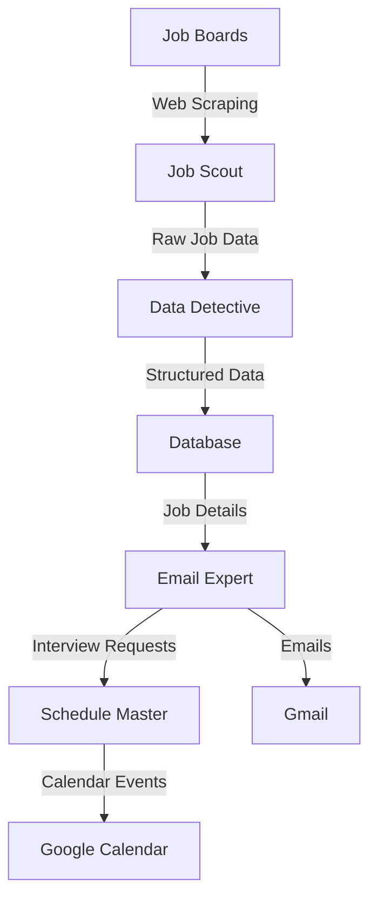
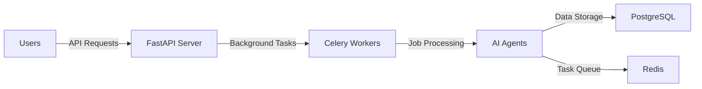

# 🤖 AI Job Search Assistant

Welcome to your personal AI-powered job search team! This smart system automates your entire job search journey, from finding the perfect positions to scheduling interviews. Think of it as having a team of AI assistants working 24/7 to land your dream job! ✨

## 🎯 What Can It Do?

Our AI assistant team handles everything:
- 🔍 Finds perfect job matches across multiple platforms
- 📝 Writes personalized applications
- 📧 Manages all email communications
- 📅 Schedules interviews automatically
- 📊 Tracks your application progress

## 🚀 Getting Started

### Quick Start (Standalone App)
```bash
# Clone the magic ✨
git clone https://github.com/Javid912/AI-job-search-assistant.git
cd job-search-assistant

# Set up your environment 🌱
python -m venv venv
source venv/bin/activate  # Windows: venv\Scripts\activate

# Install the tools 🛠️
pip install -r requirements.txt
```

### Deploy as a Web Service 🌐
```bash
# Clone and launch with Docker 🐳
git clone https://github.com/Javid912/AI-job-search-assistant.git
cd job-search-assistant
docker-compose up -d --build
```

Your web service will be ready at:
- 🔗 API: http://localhost:8000
- 📚 Docs: http://localhost:8000/docs

## 🏗️ System Architecture

Here's how our AI team works together:



### 🧠 Meet Your AI Team

#### 1. 🕵️‍♂️ Job Scout
- Searches LinkedIn, Glassdoor, Indeed
- Finds positions matching your criteria
- Analyzes company profiles

#### 2. 🔍 Data Detective
- Extracts key job requirements
- Understands company culture
- Structures information for applications

#### 3. 📧 Email Expert
- Writes personalized applications
- Sends follow-up messages
- Handles interview communications

#### 4. 📅 Schedule Master
- Manages your interview calendar
- Handles time zones automatically
- Sends calendar invites

## ⚙️ Setup & Configuration

### 1. Environment Setup
```bash
# Copy the example config
cp .env.example .env
```

### 2. Required Credentials 🔑
```env
OPENAI_API_KEY=your_openai_key
GMAIL_CREDENTIALS=path_to_credentials.json
CALENDAR_CREDENTIALS=path_to_credentials.json
SENDER_EMAIL=your_email@example.com
```

### 3. Web Service Extra Settings 🌐
```env
JWT_SECRET_KEY=your-secret-key
REDIS_URL=redis://redis:6379/0
POSTGRES_USER=postgres
POSTGRES_PASSWORD=postgres
```

## 🎨 Customization

### Job Search Preferences
```bash
python main.py --update-preferences \
    --keywords "software engineer" "python developer" \
    --locations "San Francisco" "Remote" \
    --job-types "full-time" "contract"
```

### 📧 Email Templates
Customize your communications in `email_templates/`:
- 📝 `application_template.txt`
- 🔄 `follow_up_template.txt`
- 📅 `interview_confirmation.txt`
- 🙏 `thank_you_template.txt`

## 📁 Project Structure

```
job-search-assistant/
├── 🤖 src/
│   ├── agents/
│   │   ├── job_collector.py
│   │   ├── information_extractor.py
│   │   ├── email_agent.py
│   │   └── scheduler.py
│   └── workflows/
│       └── job_search.py
├── 📧 email_templates/
├── ⚙️ config.py
└── 🚀 main.py
```

## 🛠️ Development

### Tech Stack
- 🧠 [OpenAI GPT-4](https://openai.com/gpt-4) for intelligence
- 🔄 [Phidata](https://docs.phidata.com/) for orchestration
- 🎯 [FastAPI](https://fastapi.tiangolo.com/) for web service
- 🗄️ PostgreSQL & Redis for storage

### Web Architecture


## 🤝 Contributing

Want to make this even better? Check out our [Contributing Guide](CONTRIBUTING.md)! We'd love your ideas and improvements! 

## 📈 Future Roadmap

1. **AI Enhancements**
   - 🧠 Newer language models integration
   - 📊 Job market trend analysis
   - ✍️ Smarter application writing

2. **New Features**
   - 📝 Auto resume tailoring
   - 🎯 Interview prep assistance
   - 💰 Salary negotiation support

## 📜 License

This project is licensed under the MIT License - see the LICENSE file for details.

## 🙏 Acknowledgments

- Built with ❤️ using [Phidata](https://docs.phidata.com/)
- Powered by OpenAI's GPT-4
- Inspired by job seekers everywhere

---

Happy Job Hunting! 🎉 May your next dream job be just one AI assistant away! ✨
